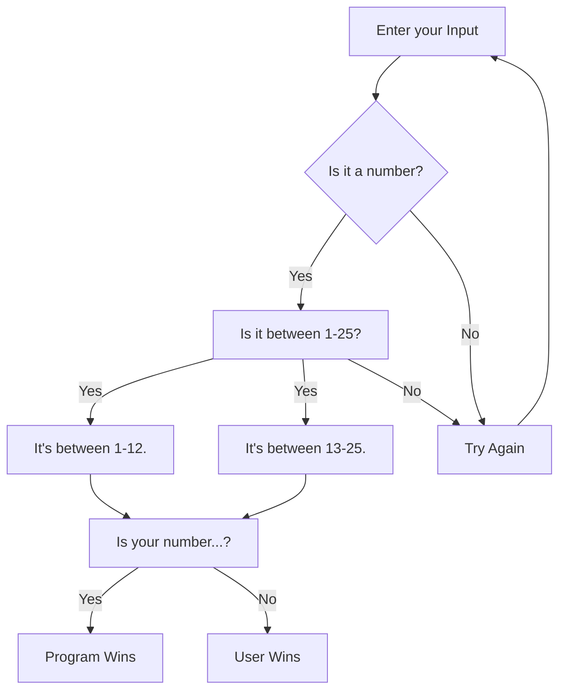

# Lab 2: Mermaid Diagrams

## Pick A Number

## How it Works

1. User keys an input.
2. The program checks if the input is a number.
   - If the input is a number, it continues to step 3.
   - If the input is not a number, it returns to step 1.
3. The program asks if the number is between 1-25.
   - If the number is not between 1-25, it returns the user to step 1; otherwise, it continues to step 4.
4. The programs asks if the number is between either 1-12 or 13-25.
   - Once it determines the range, it guesses a number.
5. Winner is determined.
